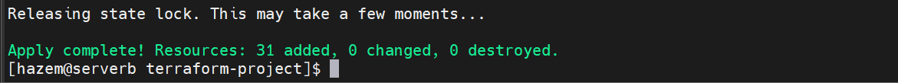

# Terraform Project
 
This project is designed to deploy infrastructure using Terraform with a focus on modularity and reusability.
 
## Project Structure
 
### Main Configuration Files
- **`main.tf`**: Contains the primary configuration for the infrastructure deployment.
- **`variables.tf`**: Defines the input variables used throughout the project.
- **`output.tf`**: Specifies the outputs that will be provided after the deployment.
 
### Custom Modules
- **Remote State Management**:
  - Uses a remote bucket to store the Terraform state file securely.
- **Provisioners**:
  - **Remote Provisioner**: Installs Apache or a proxy on the machines.
  - **Local-Exec Provisioner**: Prints all the IP addresses of the deployed resources to a file.
- **Data Source**: Retrieves the image ID for EC2 instances dynamically.
 
### Load Balancers
- **Public Load Balancer**: Distributes traffic to public-facing instances.
- **Private Load Balancer**: Manages traffic within the private network.

## VPC (Virtual Private Cloud)
 


## load-balancer
 


## s3 (bucket)


## dynamodb


## terraform apply



 
## Key Features
- **Modularity**: Reusable and maintainable code through the use of modules.
- **Scalability**: Easily adjust variables and module configurations to scale your infrastructure.
- **Security**: Secure handling of sensitive information with remote state management and provisioners.
- **Automation**: Automated setup and configuration of software on instances.
 
## Example Use Cases
- **Web Application Deployment**: Deploy a scalable web application with a public load balancer distributing traffic to multiple EC2 instances running Apache.
- **Internal Services**: Set up internal services with a private load balancer managing traffic within a VPC.
- **Dynamic Configuration**: Use data sources to dynamically fetch the latest AMI IDs.
 
## Getting Started
1. **Clone the repository**:
   ```bash
   git clone https://github.com/hazem20/terraform-project.git
   cd terraform-project
